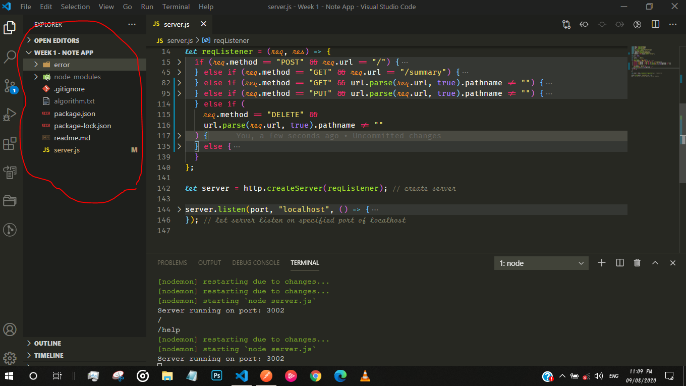
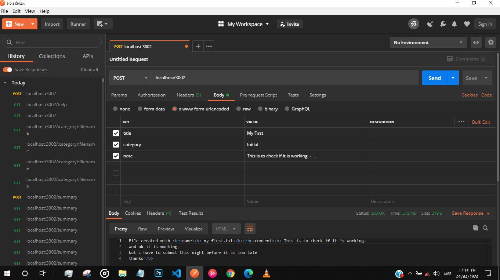
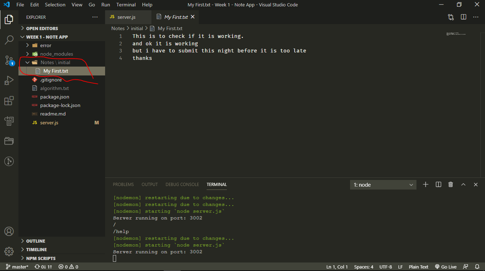
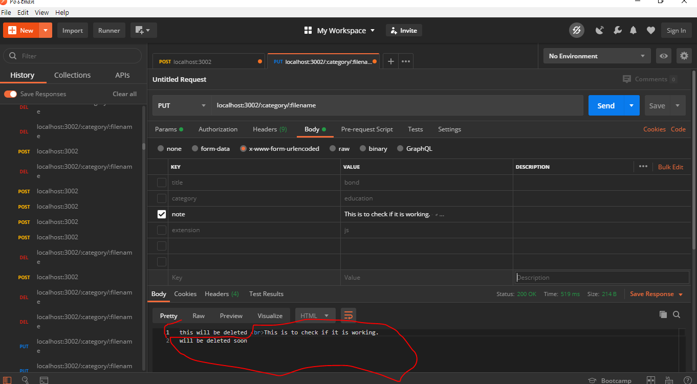
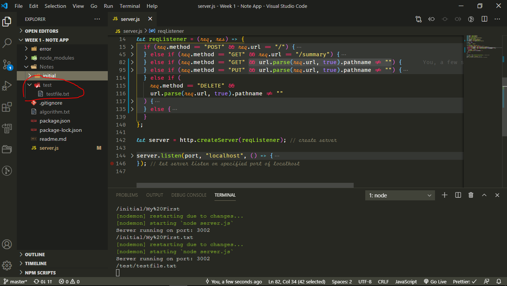
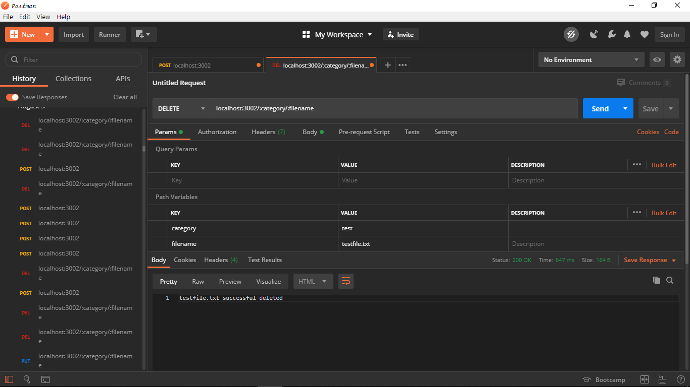
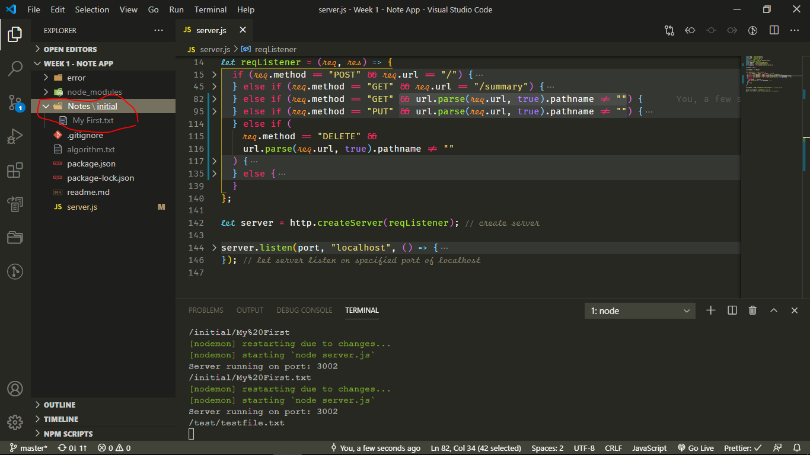

# NOTE APP

## Setting up locally

1. Make Sure you have <strong>node and postman</strong> installed on your local machine
2. Clone this repository
3. <code>CD</code> into your clone repository
4. Run <code>node sever.js</code>

## Using Postman

### Creating a note

1. Send a POST request to localhost:3002
2. You need the following fields to be filled
   - title - this will become the name of the file (Use a single word for this)
   - category - this will be a directory that contains the file
   - note - this is the content of the file
3. When you are done, inside the cloned directory you will see a <code>Notes</code> directory that houses the files sorted according to their categories(directory).

- This will automatically create a root folder called notes

### Display File Content

1. Send a GET request to localhost:3002/:category/:filename
   - under the <code>path variable section</code> of the <code>params</code> tab fill
     - category
     - filename.txt

### Updating File content

1. Send a PUT request to localhost:3002/:category/:filename
   - under the <code>path variable section</code> of the <code>params</code> tab fill
     - category
     - filename.txt
   - under the <code>Body</code> of the <code>params</code> tab fill
     - notes - this contains the text you want to add

### Deleting a file

1. Send a DELETE request to localhost:3002/:category/:filename
   - under the <code>path variable section</code> of the <code>params</code> tab fill
     - category
     - filename.txt

# Summary

1. Send a GET request to localhost:3002/sumary
